# 2025's 15 Best Website Translation Tools

Making your website speak to global audiences isn't just about swapping words anymore—it's about whether people in Madrid, Mumbai, or Montreal can actually find you, read you, and trust you enough to click that button. The right translation tool handles the invisible stuff (like search engines understanding your Spanish pages exist) while giving you control over the visible stuff (like making sure your brand voice doesn't sound like a confused robot). This roundup covers platforms that turn monolingual sites into multilingual experiences, from instant AI translation to granular editing workflows, so you can focus on growing your business instead of wrestling with language barriers.

***

## **[Weglot](https://www.weglot.com)**

The no-code champion for instant website translation across 110+ languages with built-in multilingual SEO.

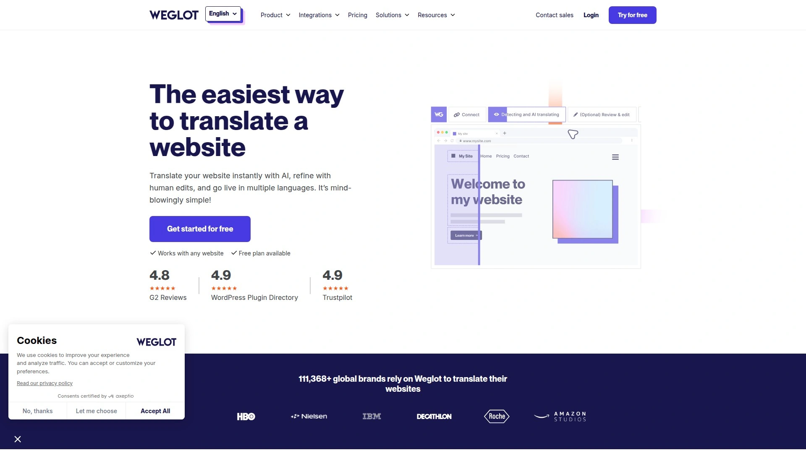

Weglot detects all your website content the moment you install it—text, buttons, menus, media—and translates everything automatically using leading machine translation engines like DeepL, Google Translate, and Microsoft Translator. You don't write a single line of code; you just add Weglot to WordPress, Shopify, Wix, Squarespace, or any custom-built site, and translated versions go live within minutes.

**What makes it different:** The visual editor lets you tweak translations directly on your live site, so you see exactly how changes appear to visitors. Translation rules automate repetitive edits (like brand names or product codes that never change), and the glossary keeps key terms consistent across every page. For quality-critical content, you can order professional human translators right inside the dashboard—no bouncing between platforms.

**Technical advantages:** Weglot automatically generates language-specific URLs, implements hreflang tags for search engines, and translates metadata so each language version ranks independently in local search results. Real-time syncing means new content gets translated as soon as you publish it. Customers report over 400% traffic increases and 20% conversion rate boosts after going multilingual with Weglot.

**Pricing structure:** Plans scale with translated words and number of languages, starting with a free tier for testing. Team collaboration features, advanced translation rules, and API access unlock at higher tiers.

***

## **[Smartling](https://www.smartling.com)**

Enterprise-grade translation management platform combining AI automation with vetted human linguists and 98+ MQM quality guarantee.

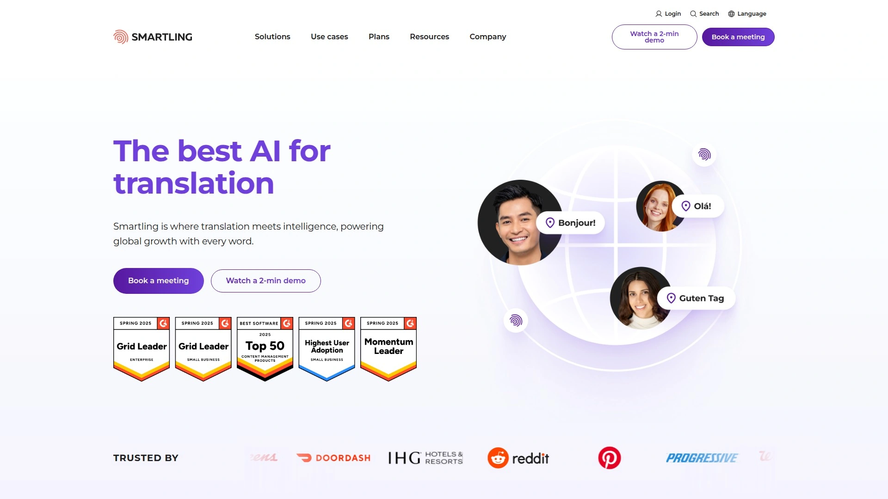

Smartling automates up to 99% of the translation process through AI-powered content detection, instant job submission, quality estimation, and auto-publishing of completed translations. The platform supports over 50 pre-built integrations with CMSs like WordPress, Adobe Experience Manager, Contentful, Drupal, and Sitecore, plus CRMs like Salesforce and Zendesk, marketing tools like Marketo and HubSpot, and code repositories like GitHub and Bitbucket.

**Enterprise capabilities:** Smartling handles millions of words and translation actions daily, scales automatically with content volume, and supports hundreds of languages and locales. In-platform Linguistic Quality Assurance (LQA) tools run AI-powered checks for tone, punctuation, and brand consistency, while visual context helps translators catch errors before they reach customers. Language Services include a 98+ MQM quality guarantee with human review using intelligent sampling.

**Security and compliance:** The platform holds SOC 2 Type II, HITRUST, HIPAA, PCI DSS Level 1, and GDPR compliance certifications, with ISO 17100 for translation services and ISO 9001:2015 for quality management—critical for healthcare, finance, and enterprise SaaS industries. Real-time job cost estimates, custom billing reports, and open APIs for finance system integration help teams control translation budgets.

**User outcomes:** Classpass reclaimed over 1,000 hours of execution time, while crypto company Gemini saved $180,000 using Smartling's automated workflows. Each customer gets a dedicated Customer Success Manager and 24/7 technical support.

***

## **[Lokalise](https://lokalise.com)**

Versatile localization heavyweight for websites, mobile apps, documents, games, and marketing assets with branching version control.

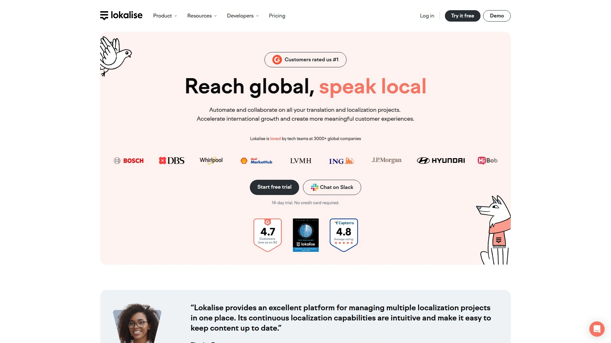

Starting at $120 per month, Lokalise targets businesses ready to localize beyond just websites—it handles mobile app strings (iOS .strings, Android XML), software formats (JSON, XML, YAML, HTML, Markdown, Gettext PO), documents (Microsoft Office, PDFs), and design files (InDesign .idml, SVG, SRT/VTT subtitles). The localization management dashboard includes branching for version control, chained tasks for sequential translation workflows, and seamless integrations with project management tools like Asana, Jira, and Trello.

Lokalise supports over 20 file formats and integrates with code repositories to automatically import new strings for translation and export completed ones back to repositories, creating a continuous localization cycle. Translation memory automatically suggests translations based on previously used phrases with similarity percentages, keys, and original text to maintain consistency. Machine translation options include DeepL, Google Translate, and AWS Translate, with AI-powered suggestions for alternative words and phrases matching your desired tone.

The platform offers a 14-day free trial for testing enterprise features before committing to the investment. Built-in issue management, real-time Slack or email notifications, shared glossaries, and transparent approval workflows let internal teams and external translators collaborate in one unified workspace.

---

## **[Phrase](https://phrase.com)**

Cloud-based localization platform prioritizing simplicity with user-friendly interface, continuous localization, and API customization.

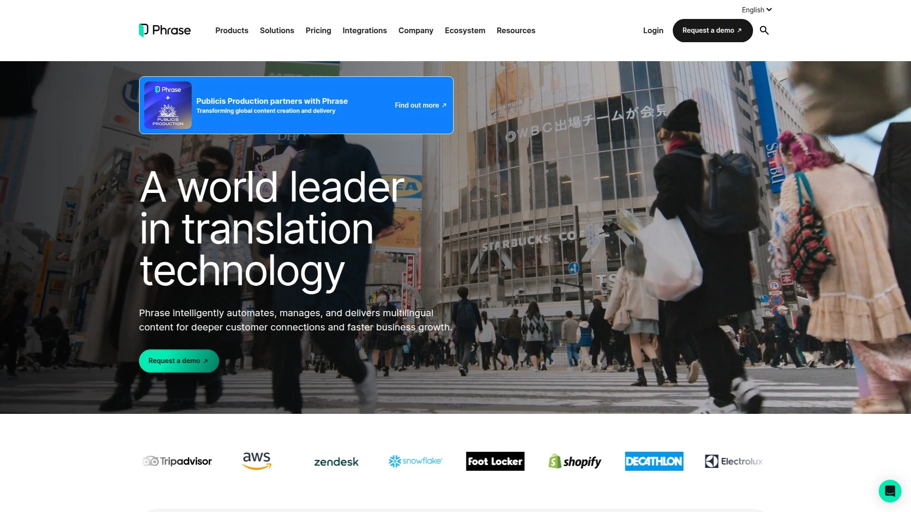

Phrase scores 9.0 for Ease of Use compared to competitors like Smartling at 8.5, with reviewers praising its intuitive interface accessible to localization newcomers while offering enough depth for experienced users. Translation management tools, team collaboration features, and terminology management come standard, with continuous localization supported through API integrations that let you customize the platform to your exact workflow.

**Developer-centric features:** Phrase focuses heavily on software localization with developer-friendly integrations, making it ideal for SaaS companies translating UI strings, help documentation, and in-app messaging. The platform supports automated workflows, promotes collaboration within translation teams, and offers robust translation memory to ensure consistent terminology across releases.

Translation memory reuses exactly matching translations across projects to avoid redundant work, while glossary enforcement maintains brand-specific terminology. AI-powered quality checks catch errors in tone, punctuation, and brand consistency before content goes live. Phrase integrates with version control systems like GitHub, GitLab, and Bitbucket to automatically sync translation updates with code deployments.

---

## **[ConveyThis](https://www.conveythis.com)**

AI-powered translation platform delivering accurate website translations across 120+ languages with live preview editing and SEO optimization.

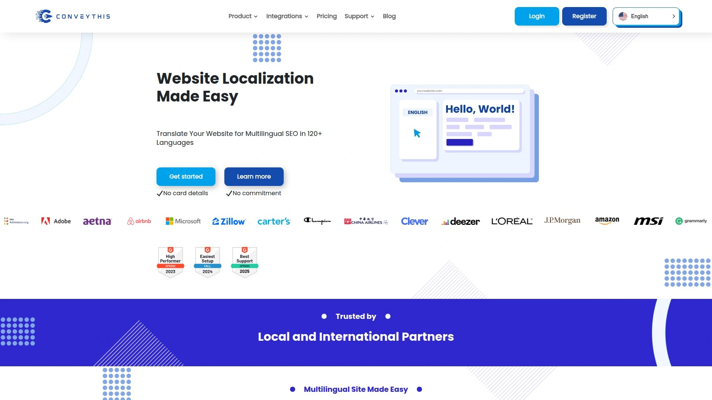

ConveyThis automatically translates every element of your site using AI speed combined with human editorial oversight through live preview editing, customizable translation rules, and terminology management. The platform creates SEO-optimized subdirectories, implements hreflang tags, and delivers server-side translations following Google's best practices for proper search engine indexing. Beyond text, ConveyThis automatically translates conversion elements like forms, pop-ups, buttons, and text within images to create a complete localized website experience.

**Workflow organization:** The dashboard and glossary ensure consistent terminology across all languages while your team edits content on live previews and publishes changes instantly. Build comprehensive glossaries that automatically maintain brand voice and technical accuracy, and choose which pages to translate for specific markets without wasting budget on irrelevant content. Localized URL structures create SEO-friendly paths for each language version.

Users report up to 4x more visibility after implementing ConveyThis, with customers like luxury real estate firm NestSeekers relying on clear, accurate translations for international buyers, and American Integrity Insurance reaching Florida's diverse communities through Spanish, Haitian Creole, and Portuguese translations. The service fits seamlessly with websites from minimalist blogs to large, complex e-commerce platforms.

***

## **[Crowdin](https://crowdin.com)**

Developer and community-focused translation platform with automation, project management, and crowdsourcing capabilities.

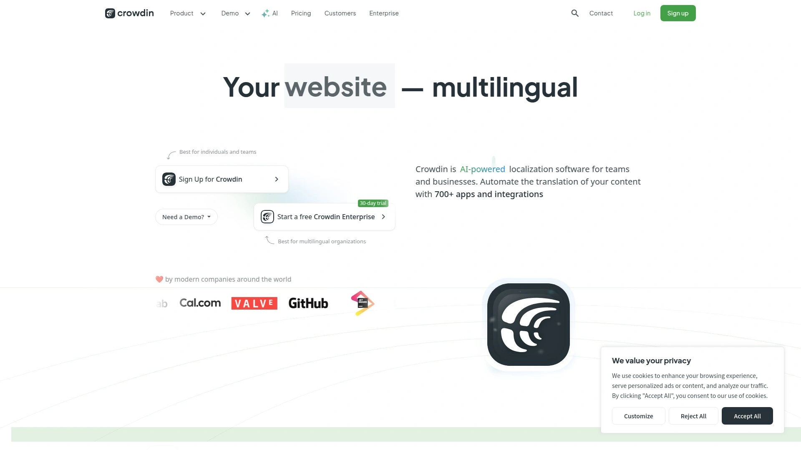

Crowdin excels in Quality of Support with a 9.1 score, offering responsive assistance for technical questions and setup issues. The platform automates specific translation tasks while providing robust project management features and connections to third-party translation vendors. UI support, in-context editing, and screenshot functionality make Crowdin accessible for non-developers managing localization projects.

**Community translation:** Crowdin's crowdsourcing feature lets you tap into volunteer translator communities, making it cost-effective for open-source projects and startups with budget constraints. You control access through contributor management settings, choosing whether translations go live immediately or require approval. The platform supports continuous localization with API integrations that automatically sync new content for translation as you develop.

Translation memory recovers deleted strings or previous translation variants through the History module, while cross-project memory reuses exactly matching translations to eliminate redundant work. Machine translation options include DeepL, Google Translate, and AWS Translate, giving translators AI-powered suggestions they can refine for accuracy. Slack and Microsoft Teams integrations provide real-time reporting on localization project events.

***

## **[Transifex](https://www.transifex.com)**

Context-aware AI translation platform continuously refined to adhere to your brand voice, built for translating websites and applications.

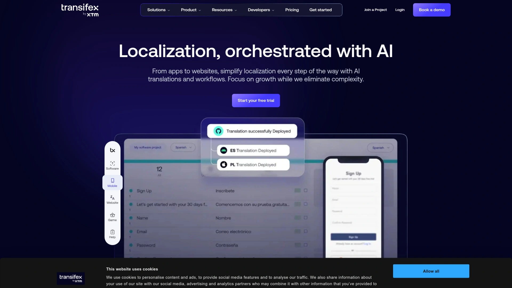

Transifex AI delivers large-scale, context-aware translations that continuously learn and adapt to your brand's specific terminology, tone, and style preferences. The platform focuses on providing translation insights and tools specifically designed for websites and application interfaces, with features that make technical localization accessible to both developers and translators.

The system supports automated workflow processes that reduce manual translation tasks, freeing teams to focus on quality refinement rather than repetitive work. Integration capabilities connect Transifex with development environments and content management systems, enabling continuous localization where new strings get translated automatically as they're added to your codebase. Translation memory and glossary tools maintain consistency across your entire application, ensuring technical terms and brand language remain uniform across all localized versions.

Real-time collaboration features let distributed teams work simultaneously on translation projects, with permission controls determining who can translate, review, or approve content before it goes live. The platform tracks translation progress and quality metrics, giving project managers visibility into which languages need attention and how translation costs are accumulating.

***

## **[WPML](https://wpml.org)**

WordPress multilingual plugin making over a million sites multilingual, powerful enough for corporate sites yet simple for blogs.

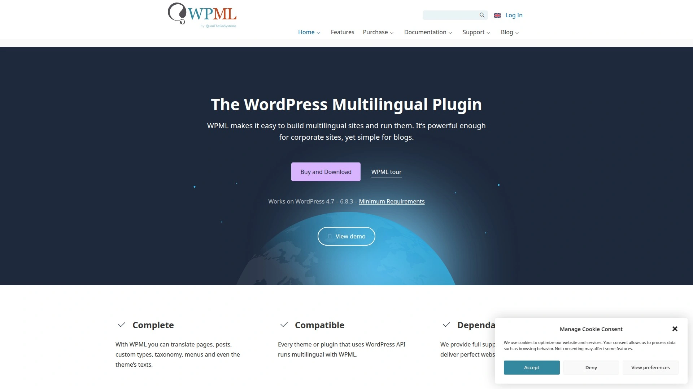

WPML dominates the WordPress translation space with built-in integrations for 80+ professional translation services, letting you easily outsource translations to real human translators without finding freelancers yourself. The Advanced Translation Editor pre-populates translation fields with automatic translations from DeepL, Google Translate, or Microsoft Translator, which you can then accept or edit. Translation Management interface lets you bulk select multiple pieces of content or strings using checkboxes and apply automatic translation to all selected items simultaneously.

**Enterprise workflow features:** WPML lets you assign specific translations to specific translators, critical when managing translation teams with specialized expertise in different content types. You can create dedicated translator accounts via your WordPress dashboard, giving team members access only to translation functions without exposing other site management features. The plugin handles WooCommerce product translations, multilingual SEO, and compatibility with popular page builders like Elementor and Divi.

WPML supports manual translation for complete control, automatic machine translation for speed, and professional human translation for quality-critical content—often combining all three approaches across different sections of the same site. Translation memory keeps phrasing consistent, while glossaries maintain brand-specific terminology across thousands of pages.

***

## **[TranslatePress](https://translatepress.com)**

Free WordPress translation alternative offering sitewide automatic translation with simple point-and-click visual interface for 132 languages.

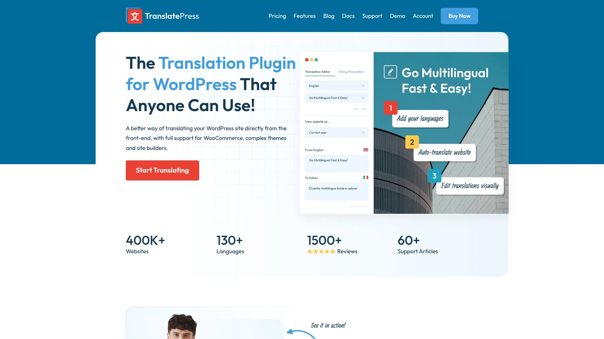

TranslatePress scores high marks for simplicity with its visual, point-and-click translation interface that lets you translate content directly on the front end of your site—you see exactly what visitors will see as you work. Unlike WPML's backend editor approach, TranslatePress shows translations in context with your actual page layout, buttons, and images, reducing errors from misunderstood positioning or character limits.

**Automatic translation setup:** Configure automatic translation once and those settings work across your entire site, with tools to control daily usage limits to stay within free tiers of services like Google Translate. The plugin supports DeepL for accuracy-focused translations and Google Translate for broader language coverage, letting you choose based on your target markets. Automatic translation pre-populates translation fields as a starting point, which you then refine manually for brand voice and nuance.

Premium version lets you create dedicated translator accounts via WordPress dashboard, giving translators access only to translation management functions. TranslatePress handles WooCommerce stores, multilingual SEO with proper hreflang tags, and compatibility with popular WordPress themes and plugins without requiring developer intervention. The free version includes one language translation, making it ideal for testing multilingual strategies before committing budget.

***

## **[Linguise](https://www.linguise.com)**

Automatic translation plugin for WordPress combining machine translation speed with manual editing control and SEO optimization.

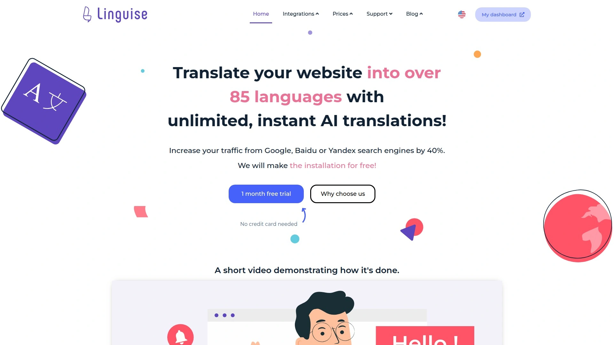

Linguise ranks among the best localization platforms for 2025 as a cost-effective automatic translation solution. The plugin automatically detects website content and pulls it into the dashboard for review and machine translations, streamlining the workflow from detection to publication. Unlike manual-first approaches, Linguise prioritizes automation with machine translation engines handling the initial translation layer, then provides editing tools for refinement.

**SEO and performance:** Linguise implements multilingual SEO best practices including language-specific URLs, hreflang tags for search engine indexing, and translated metadata to help each language version rank independently in local search results. The platform integrates seamlessly with WordPress sites and popular themes without requiring code changes or complex configuration. Translation memory maintains consistency across your site by reusing previously translated phrases automatically.

The dashboard provides centralized management of all translations with filtering options to quickly find specific content needing updates. You can exclude certain pages from translation to save quota on admin pages or locale-specific content that shouldn't be multilingual. Linguise supports continuous updates where new content automatically gets translated as you publish it, keeping all language versions synchronized without manual intervention.

***

## **[Localize](https://localizejs.com)**

No-code translation management service for software platforms leveraging AI to translate web apps, UI, websites, help docs, and emails.

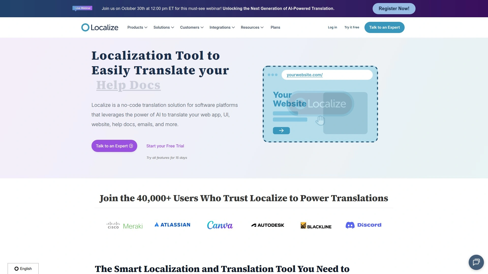

Localize automatically detects all your content and pulls it into the dashboard for review and machine translations across more than 100 languages, positioning itself as a complete multilingual translation management system (TMS). The platform uses a no-code approach where you add a single JavaScript snippet to your site, and Localize handles content detection, translation, and publishing without requiring changes to your codebase.

**Software-focused features:** Localize specializes in translating dynamic web applications, user interfaces, SaaS dashboards, help documentation, and automated email sequences—content that updates frequently and needs continuous localization. The platform catches new strings as they're added to your app and automatically queues them for translation, creating a continuous localization workflow that keeps pace with your development cycle. Integration options connect Localize with your existing tech stack through APIs and webhooks, automating translation workflows without manual file exports and imports.

The visual editor lets you see translations in the context of your actual application interface, catching issues with text length, button sizing, or layout breaks before they affect users. Translation memory suggests previously used translations for similar phrases, maintaining terminology consistency across your entire application. Machine translation provides the initial translation layer using leading AI engines, which you can then refine manually or send to professional translators for quality-critical content.

***

## **[POEditor](https://poeditor.com)**

Lightweight, developer-friendly localization platform with real-time online translation editor and extensive file format support.

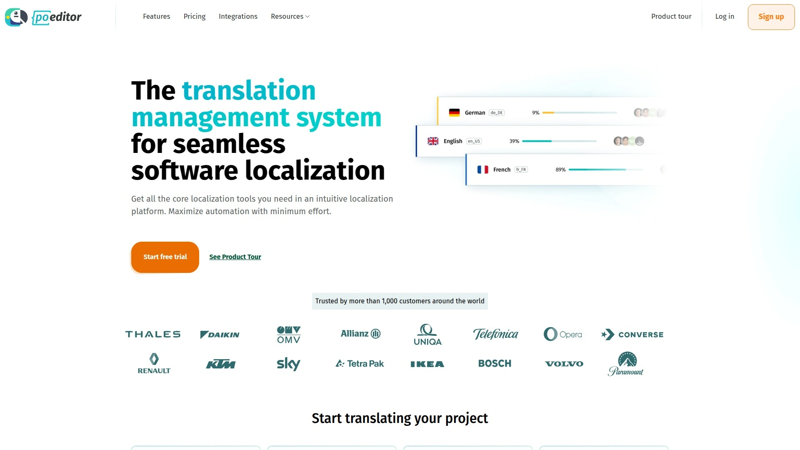

POEditor targets developers looking for streamlined translation management without the complexity of enterprise platforms, though linguists and other localization team members find it equally accessible. The platform supports over 20 localization file formats including .po (Gettext), .json (key-value and WebExtensions), .xml (Android), .strings (iOS), .properties, .xliff, and more. Direct integrations with code repositories like GitHub, Bitbucket, GitLab, and Azure Repos let you quickly transfer strings between POEditor and your git services, with webhooks, callbacks, and pull request presets enhancing automation.

**Collaboration tools:** POEditor notifies translators when they're working on the same language page or translating the same string simultaneously, and automatically saves translations in real-time to prevent conflicts. Tag management lets you group strings in translation projects for easier organization, while team management features let you group contributors and assign them to specific languages or projects. Comments and screenshots provide translators with context about how strings should be translated, reducing back-and-forth questions.

**Translation options:** You can assign translators to specific languages as contributors, crowdsource translations from your community using public projects, order human translation services from integrated partners, or use machine translation and AI translation for speed. The History module recovers deleted strings or shows previous translation variants, while cross-project Translation Memory reuses exactly matching translations automatically. Slack and Microsoft Teams integrations provide live reporting about important events in your localization projects in real-time.

***

## **[Tolgee](https://tolgee.io)**

Open-source localization tool with in-context translation, one-click screenshots, and support for DeepL, Google Translate, and AWS Translate.

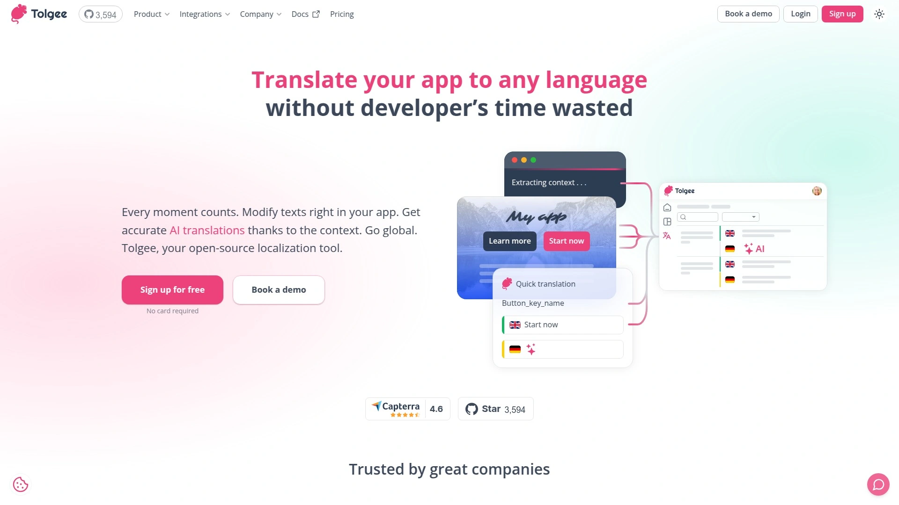

Tolgee differentiates itself through in-context translation that works seamlessly even in production environments of deployed apps. Hold ALT/Option and click any element on your website to open a dialog where you modify strings effortlessly without navigating through bulky .json, .po, or other translation files. One-click screenshots capture your application with highlighted phrases for translation—just hold ALT, click a string, then hit the camera button to instantly generate screenshots.

**Production translation:** The Tolgee Tools Chrome plugin lets anyone translate your live website by simply entering an API key—no coding skills required, making it easy for marketing teams or clients to contribute translations directly. True integration through powerful SDKs embeds Tolgee into your app rather than just syncing local data with a backend, providing a genuinely embedded translation experience. Native SDKs support Vanilla JS, React frameworks, Angular, VueJS, and other popular technologies.

**Automation features:** Auto translation instantly translates new keys using translation memory or machine translation services the moment you create them, with options to choose whether to use translation memory and select your preferred machine translation service (DeepL, Google Translate, or AWS Translate). Translation memory automatically suggests translations based on previously used phrases with similarity percentage, key, and original text to maintain consistency. Activity log tracks who modified, reviewed, or commented on phrases with complete clarity, while translation history shows changes to specific translations for accountability.

***

## **[Pontoon](https://pontoon.mozilla.org)**

Mozilla's open-source localization platform supporting .dtd, .ftl (Fluent), .ini, .json, .po (Gettext), .properties, .xliff, and .xml formats.

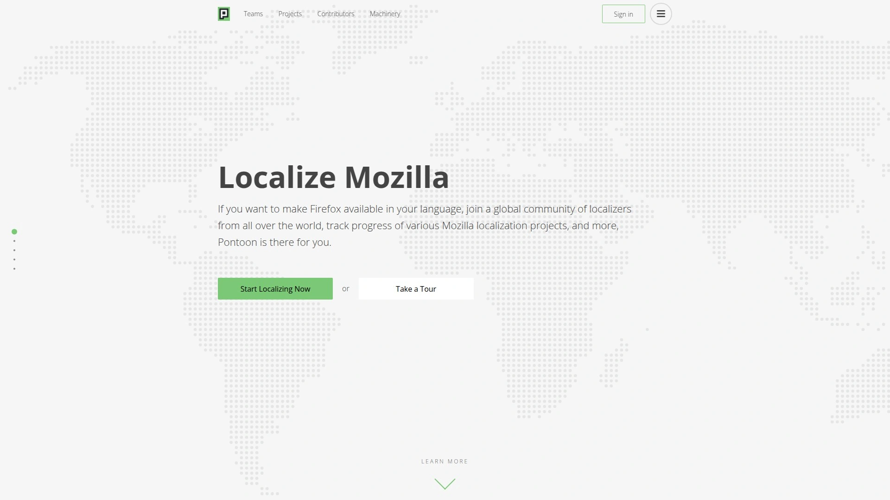

Pontoon is an enterprise-grade translation management system released under the BSD 3-clause open-source license, used and developed by Mozilla's global localization community. The platform specializes in open-source localization, making it ideal for projects wanting community involvement in translations without the cost of commercial platforms. Pontoon pulls strings from external version control repositories (Git and Mercurial), translators work on them through the web interface, and Pontoon writes completed translations back to the repositories periodically—creating an automated sync between your code and translations.

**Enterprise features:** Pontoon includes multi-team and multi-project support backed by PostgreSQL database, easy deployment options, a publicly available roadmap, and a fully integrated login and administration system. The platform supports an impressive range of localization file formats including .dtd, .ftl (Fluent), .inc, .ini, .json (WebExtensions and key-value), .lang, .po (Gettext), .properties, .xliff, and .xml (Android). In-context translation lets translators see exactly where strings appear in the actual application interface, reducing errors from misunderstood context.

Pontoon emphasizes community involvement with tools for managing volunteer translator communities globally. Translators receive notifications about project updates and can collaborate on translations in real-time. Mozilla maintains comprehensive documentation for both administrators deploying Pontoon instances and localizers using it for translation projects. The platform automatically imports new strings for translation and exports completed ones back to repositories, ensuring a seamless update cycle.

***

## **[Bablic](https://www.bablic.com)**

Quick and easy localization solution translating websites within minutes through automated content localization with translator focus.

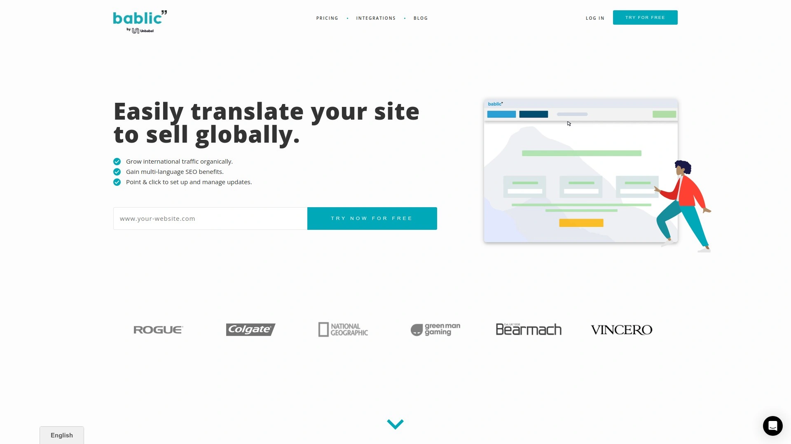

Bablic positions itself as the quickest website translation solution, automating content localization so translators can focus purely on language quality while the platform handles technical implementation. The service detects website content automatically and provides instant translations using machine translation engines as a starting point. Unlike platforms requiring extensive setup, Bablic gets sites multilingual within minutes through simplified installation and configuration.

**Translator-centric approach:** Bablic automates all technical aspects of website localization—detecting content, managing translations, implementing language switchers, and handling SEO—letting translators focus exclusively on translation quality without worrying about code or technical setup. This approach makes Bablic particularly suitable for translation agencies and freelance translators working with clients who need multilingual sites but lack technical expertise. The platform achieves results instantly while still allowing customization for specific translation needs.

Bablic integrates with websites regardless of platform or technology, detecting all translatable content including text, forms, buttons, and dynamic elements. The service handles SEO implementation automatically, creating language-specific URLs and implementing hreflang tags without requiring technical knowledge from users. Translation management includes features for editing machine translations, maintaining glossaries for consistent terminology, and collaborating with team members or clients on translation projects.

***

## FAQ

**How do I choose between automatic and human translation for my website?**

Start with automatic translation for getting content online quickly, then prioritize human translation for high-conversion pages like landing pages, product descriptions, and legal terms. Most platforms let you mix both approaches—use AI for blog archives and help documentation where speed matters more than perfection, then invest translator budget on pages directly driving revenue. Check machine translation quality in your target languages first; DeepL typically outperforms Google Translate for European languages, while coverage matters more for less common languages.

**What's the difference between translation management systems and simple website translation plugins?**

Translation management systems (TMS) like Smartling, Lokalise, and Phrase handle complex workflows including assigning tasks to specific translators, version control, quality assurance checks, and translating across multiple content types beyond just websites—think mobile apps, documents, and marketing materials. Simple website translation plugins like Weglot, ConveyThis, and TranslatePress focus specifically on getting your site multilingual fast with less workflow complexity, making them ideal for small to medium businesses wanting multilingual sites without managing translation teams. Choose TMS for enterprise needs with dedicated localization teams, choose plugins for speed and simplicity with smaller teams.

**Do website translation tools actually help with SEO in different languages?**

Yes, quality translation tools implement critical multilingual SEO elements automatically: language-specific URLs (like yoursite.com/es/ for Spanish), hreflang tags telling search engines which language version serves which audience, and translated metadata including titles and descriptions. These technical implementations let each language version rank independently in local search results rather than competing with your English site. Tools with server-side translation (rather than JavaScript-based) perform better for SEO since search engines can crawl translated content directly. Weglot users report over 400% traffic increases specifically from improved multilingual SEO.

***

## Conclusion

The website translation tool you pick ultimately depends on whether you need to translate five pages or five thousand, whether you're running a WordPress blog or a custom-built SaaS platform, and whether you have dedicated localization teams or you're doing this solo between other responsibilities. For businesses wanting the fastest path to multilingual without touching code, **[Weglot](https://www.weglot.com)** delivers instant translation across 110+ languages with built-in SEO and a visual editor that shows exactly how translations appear on your live site—making it ideal for e-commerce stores, marketing sites, and small to medium businesses expanding internationally without hiring translation specialists.
